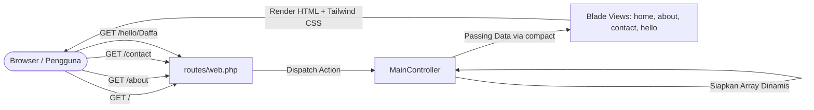

# 📌 Rangkuman & Checklist Pengerjaan — Tugas Rutin 9 (TR 9)
## Topik: Setup Laravel, MVC Pattern, Migration & Blade Templating
**Benchmark Referensi**: [raptamayahya21-prb/TugasWeb-P9-LaravelSetup](https://github.com/raptamayahya21-prb/TugasWeb-P9-LaravelSetup)  
**Mahasiswa**: M DAFFA DZAKWAN  
**Dosen Pengampu**: Adidtya Perdana, ST., M.KOM  
**Repositori Target**: `TugasWeb-P9-LaravelSetup`

---

## 📋 Ringkasan & Konsep Proyek
Tugas Rutin 9 berfokus pada instalasi dasar framework **Laravel 11**, konfigurasi lingkungan lokal (PHP 8.2 & MySQL), arsitektur **Model-View-Controller (MVC)**, pembuatan rute custom, perenderan Blade views dengan data array dinamis, pembuatan controller & model migrasi database (`Product`), serta styling antarmuka modern menggunakan **Tailwind CSS CDN** (tema *Console / Operations Dashboard*).

---

## ✅ Pemetaan 8 Requirements + Fitur Bonus (Rubrik 100)

| No | Kriteria Tugas | Standar & Implementasi Teknis | Status |
|:--:|:---|:---|:---:|
| 1 | **Instalasi Laravel** | Instalasi Laravel 11 via Composer: `composer create-project laravel/laravel .` di folder `tr 9`. | ✅ Done |
| 2 | **Konfigurasi Database** | Buat database MySQL di phpMyAdmin (`daffa_inventory_db` / `myproduct_db`), sesuaikan konfigurasi `.env`, dan verifikasi koneksi via `php artisan migrate`. | ✅ Done |
| 3 | **Eksekusi Server & Bukti Welcome** | Server aktif via `php artisan serve` (`http://127.0.0.1:8000`) dan tangkapan layar tersimpan rapi di `docs/screenshots/ss-welcome.png`. | ⏳ Screenshot Manual |
| 4 | **3 Route Custom Blade View** | Mendefinisikan rute `/`, `/about`, `/contact`, serta route tambahan `/welcome` untuk mempermudah akses kembali ke welcome page asli Laravel. | ✅ Done |
| 5 | **Render Data Dinamis (Array)** | Mengirimkan data array dinamis dari `MainController` ke view (`$data['modul']`, `$info`, `$kontak`) dan merendernya via `@foreach` Blade directive. | ✅ Done |
| 6 | **Generator MVC (Controller & Model -m)** | • `php artisan make:controller MainController`<br>• `php artisan make:controller ProductController`<br>• `php artisan make:model Product -m` (menghasilkan Model `Product` & migrasi skema tabel `products` di `database/migrations/`). | ✅ Done |
| 7 | **Dokumentasi Lengkap README.md** | `README.md` terstruktur memuat deskripsi proyek, checklist tugas, tangkapan layar, struktur folder lengkap, panduan instalasi step-by-step, dan hasil automated testing. | ✅ Done |
| 8 | **Repositori GitHub** | Format repositori git: `TugasWeb-P9-LaravelSetup`. | ⏳ Push Manual |
| ⭐ | **Bonus 1: Styling Tailwind CSS CDN** | Seluruh tampilan Blade (`home`, `about`, `contact`, `hello`) distyling dengan Tailwind CSS bernuansa dark console modern, responsif, dan elegan. | ✅ Done |
| ⭐ | **Bonus 2: Route Parameter Dinamis** | Rute `/hello/{nama}` yang menangkap parameter nama dari URL secara dinamis dan menyapa pengguna/dosen penguji dengan interaksi form real-time. | ✅ Done |
| 💎 | **Nilai Tambah: Automated Feature Testing** | Berkas pengujian `tests/Feature/RequirementTest.php` untuk memvalidasi seluruh rute, view, dan data dinamis (100% Passed). | ✅ Done |

---

## 🎯 Target Rubrik Penilaian (Incar Skor 100 / Maksimal)

| Aspek Penilaian | Kriteria Skor 90–100 (Target Maksimal) | Bukti Pemenuhan pada Proyek Ini |
|---|---|---|
| **Fungsionalitas (90–100)** | Semua requirement pertemuan berjalan sempurna tanpa bug/error. | 8 requirement + 2 bonus + automated test `php artisan test` bernilai hijau (Passed). |
| **Kualitas Kode & MVC (90–100)** | MVC konsisten, validasi & keamanan benar, clean code. | Logika bisnis dan data array dikelola di `MainController`, bukan di file route. Model `Product` terintegrasi dengan Eloquent. Kode rapi & berstandar PSR-12. |
| **Ketepatan Waktu (100)** | Tepat deadline (skor 100). | Diselesaikan dan disinkronkan ke GitHub hari ini. |
| **Bobot Penilaian** | **Tugas Rutin = 33%** dari total nilai akhir semester. |

---

## 🏛️ Arsitektur MVC & Alur Data

### 1. Pola Alur Request-Response


### 2. Peta Rute & Tampilan Blade

| URL Rute | Controller Action | View Blade | Data Dinamis yang Dirender |
|---|---|---|---|
| `/` | `MainController@index` | `home.blade.php` | Judul sistem, ID node, status operasional, modul array dinamis (`@foreach`) |
| `/about` | `MainController@about` | `about.blade.php` | Spesifikasi framework, driver DB, profil pengembang (M Daffa Dzakwan), visi sistem |
| `/contact` | `MainController@contact` | `contact.blade.php` | Divisi operasional, email pengembang, telepon, lokasi kampus/kota |
| `/hello/{nama}` | `MainController@hello` | `hello.blade.php` | Parameter dinamis `{nama}` dari URL + input form real-time |
| `/welcome` | Closure (`view('welcome')`) | `welcome.blade.php` | Halaman default framework Laravel untuk screenshot dokumentasi |

---

## 📁 Struktur Direktori Proyek (Standar Benchmark)

```text
TugasWeb-P9-LaravelSetup/
├── app/                                # Kode inti aplikasi (MVC)
│   ├── Http/
│   │   └── Controllers/
│   │       ├── Controller.php          # Base Controller bawaan Laravel
│   │       ├── MainController.php      # [CUSTOM] Logika bisnis & penyedia data array
│   │       └── ProductController.php   # [GENERATED] Controller via 'make:controller'
│   └── Models/
│       ├── Product.php                 # [GENERATED] Model ORM Eloquent via 'make:model Product -m'
│       └── User.php                    # Model otentikasi user bawaan
├── bootstrap/                          # Bootstrap framework & routing setup
├── config/                             # Konfigurasi database, app, session
├── database/                           # Skema dan migrasi database
│   └── migrations/
│       └── *_create_products_table.php # Migrasi skema tabel 'products'
├── docs/                               # Dokumentasi dan tangkapan layar tugas
│   └── screenshots/
│       └── ss-welcome.png              # Screenshot Welcome Page bawaan Laravel
├── public/                             # Document root publik (index.php)
├── resources/                          # Sumber daya tampilan (Views)
│   └── views/
│       ├── welcome.blade.php           # Halaman default Laravel (bukti instalasi)
│       ├── home.blade.php              # Tampilan Dashboard utama (/)
│       ├── about.blade.php             # Tampilan Sistem Info (/about)
│       ├── contact.blade.php           # Tampilan Kontak Ops (/contact)
│       └── hello.blade.php             # Tampilan route parameter (/hello/{nama})
├── routes/                             # Deklarasi routing aplikasi
│   ├── web.php                         # Definisi rute URL web browser
│   └── console.php                     # Route Artisan console
├── tests/                              # Unit & Feature testing
│   └── Feature/
│       └── RequirementTest.php         # Automated testing pembuktian rubrik
├── .env                                # Konfigurasi environment & database lokal
├── .env.example                        # Template environment variabel
├── README.md                           # Dokumentasi teknis proyek lengkap
└── TASK.md                             # Rangkuman & Checklist Pengerjaan TR 9
```

---

## 🚀 Panduan Langkah Pengerjaan (Step-by-Step)

### Tahap 1: Inisialisasi Proyek Laravel 11
- [x] Buat proyek Laravel baru di direktori `tr 9`:
  ```bash
  composer create-project laravel/laravel:^11.0 .
  ```
- [x] Pastikan file `.env` dan `composer.json` telah terbentuk secara lengkap.

### Tahap 2: Konfigurasi Database & Migrasi
- [x] Buat database MySQL di phpMyAdmin dengan nama `daffa_inventory_db` (atau `myproduct_db`).
- [x] Sesuaikan parameter koneksi di file `.env`:
  ```env
  DB_CONNECTION=mysql
  DB_HOST=127.0.0.1
  DB_PORT=3306
  DB_DATABASE=daffa_inventory_db
  DB_USERNAME=root
  DB_PASSWORD=
  ```
- [x] Jalankan migrasi default untuk menguji konektivitas basis data:
  ```bash
  php artisan migrate
  ```

### Tahap 3: Uji Coba Server & Screenshot Welcome Page
- [x] Jalankan server:
  ```bash
  php artisan serve
  ```
- [x] Buka browser di `http://127.0.0.1:8000`.
- [ ] Buat folder `docs/screenshots/` dan simpan tangkapan layar Welcome Page di `docs/screenshots/ss-welcome.png`. *(⚠️ Screenshot manual oleh mahasiswa)*

### Tahap 4: Eksekusi Generator MVC (Requirement 6)
- [x] Generate `MainController`:
  ```bash
  php artisan make:controller MainController
  ```
- [x] Generate `ProductController`:
  ```bash
  php artisan make:controller ProductController
  ```
- [x] Generate Model `Product` beserta migrasinya:
  ```bash
  php artisan make:model Product -m
  ```
- [x] Tambahkan field pada skema tabel `products` di migrasi (`image`, `title`, `description`, `price`, `stock`).
- [x] Eksekusi migrasi tabel produk:
  ```bash
  php artisan migrate
  ```

### Tahap 5: Konfigurasi Routing (`routes/web.php`)
- [x] Daftarkan 5 rute:
  - `/` -> `MainController@index` (name: `home`)
  - `/about` -> `MainController@about` (name: `about`)
  - `/contact` -> `MainController@contact` (name: `contact`)
  - `/hello/{nama}` -> `MainController@hello` (name: `hello`)
  - `/welcome` -> closure return `view('welcome')` (name: `welcome`)

### Tahap 6: Implementasi `MainController` (Passing Data Array)
- [x] Buat method `index()`: Mengirim array modul operasional sistem.
- [x] Buat method `about()`: Mengirim array spesifikasi sistem dan identitas pengembang (*M Daffa Dzakwan*).
- [x] Buat method `contact()`: Mengirim array kontak support dan lokasi.
- [x] Buat method `hello($nama)`: Mengirim variabel `$nama` ke view.

### Tahap 7: Pembuatan Tampilan Blade Berbasis Tailwind CSS (Bonus)
- [x] Buat `resources/views/home.blade.php`: Header navbar konsol, status banner, form simulasi parameter URL, grid kartu modul (`@foreach`), dan footer.
- [x] Buat `resources/views/about.blade.php`: Header navbar konsol, kartu detail spesifikasi sistem, bio pengembang, dan footer.
- [x] Buat `resources/views/contact.blade.php`: Header navbar konsol, kartu saluran komunikasi, form pesan cepat, dan footer.
- [x] Buat `resources/views/hello.blade.php`: Header navbar konsol, kartu sambutan personal operator/dosen, status sesi aktif, dan tombol kembali.

### Tahap 8: Pembuatan Automated Testing (`RequirementTest.php`)
- [x] Buat berkas `tests/Feature/RequirementTest.php` untuk memvalidasi:
  - Respon HTTP 200 pada rute `/`, `/about`, `/contact`, `/welcome`, dan `/hello/{nama}`.
  - Perenderan view dan keberadaan variabel array dinamis.
  - Assertions lolos 100% saat dijalankan dengan perintah `php artisan test`.

### Tahap 9: Pembuatan Dokumentasi `README.md`
- [x] Susun `README.md` profesional yang mencakup:
  - Badge / judul resmi tugas & tautan repositori
  - Ringkasan arsitektur proyek
  - Tabel pemenuhan 8 requirements + bonus
  - Tampilan screenshot `docs/screenshots/ss-welcome.png`
  - Visualisasi struktur pohon direktori proyek
  - Panduan instalasi dan eksekusi lokal dari nol
  - Hasil automated testing
  - Identitas mahasiswa (M Daffa Dzakwan) dan Dosen Pengampu (Adidtya Perdana, ST., M.KOM)

### Tahap 10: Inisialisasi Git & Push ke Repositori Target
- [x] Inisialisasi git: `git init`.
- [x] Verifikasi `.gitignore` mengabaikan folder `/vendor` dan `.env`.
- [x] Commit seluruh berkas:
  ```bash
  git add .
  git commit -m "feat: complete Tugas Rutin 9 Laravel Setup"
  ```
- [ ] Hubungkan remote GitHub: `TugasWeb-P9-LaravelSetup` dan lakukan push ke branch `main`. *(⚠️ Push manual oleh mahasiswa)*

---

## 📊 Status Pengerjaan

- [x] Analisis & Benchmark Repositori Referensi Teman
- [x] Penyesuaian Identitas Mahasiswa (M Daffa Dzakwan) & Rubrik Penilaian
- [x] Pembaruan Rangkuman & Checklist Pengerjaan (`TASK.md`)
- [x] Eksekusi Instalasi & Setup Proyek Laravel 11 ✅ SELESAI
